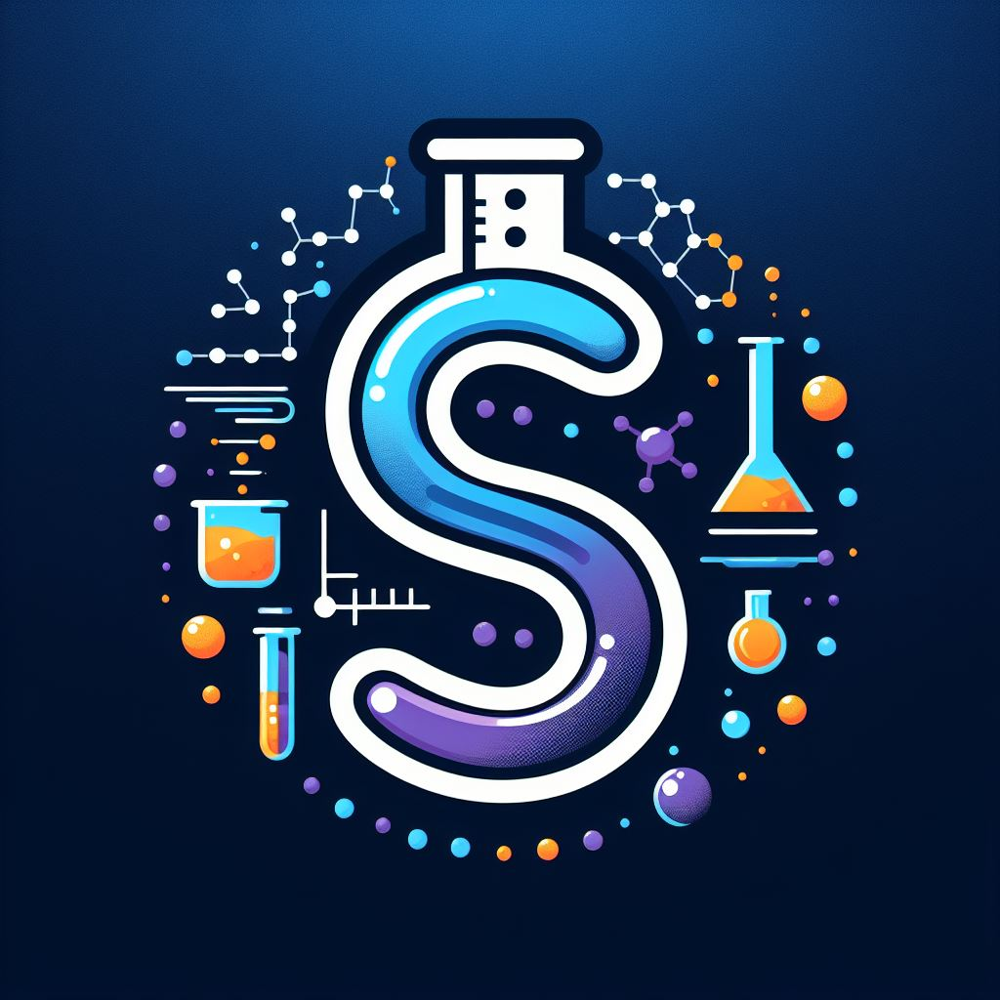

<div>
        
</div>

# Fármacos Solução 

**Grupo:** Galajo
<br>
**Integrantes:** Gabriela Frajtag, João Pedro da Silva Mariano, Laís Fernanda Medeiros Ruela
<br>
**Instituição:** Ilum - Escola de ciência
<br>


## Introdução
Neste projeto, propomos a utilização de redes neurais (NN) para prever a solubilidade de compostos químicos, um fator crucial na absorção de fármacos (ADME: Absorção, Distribuição, Metabolismo e Excreção). A solubilidade de um composto é um indicador importante de sua capacidade de ser absorvido pelo corpo humano, portanto, sua predição é essencial no desenvolvimento de novos medicamentos.

Se um laboratório está realizando um projeto de triagem, é provável que precise avaliar um grande número de compostos. No entanto, realizar a medida experimental da solubilidade para cada um desses compostos é inviável, já que o processo experimental para muitos compostos é demorado e caro, se tornando impraticável. Dessa forma, abordagens computacionais, como o uso de redes neurais, surgem como alternativas viáveis para prever a solubilidade de grandes conjuntos de compostos, a fim de selecionar os mais interessantes para prosseguir na parte experimental.


<figure>
  
  <figcaption>Diagrama ADME (imagem retirada da Wikipedia)</figcaption>
</figure>

## Estrutura do Repositório

Nesse repositório, há três arquivos:
* projeto_NN.ipynb
* logo_projeto_final.jpg
* README.md


### Requisitos
Para a execução correta do projeto, é necessário ter o ambiente configurado com as seguintes bibliotecas:

- **rdkit:** ferramenta de quimioinformática que usada para utilizar objetos moleculares
- **lightning:** estrutura de treinamento de modelos flexível e escalável para PyTorch.
- **matplotlib:** utilizado para plotar e visualizar de dados 
- **pandas:** biblioteca para recebimento e análise de dados em Python
- **torch:** utilizada para a criação do modelo de Redes Neurais
- **scikit-learn:** usada para várias tarefas do aprendizado de máquina, como o split de dados e escalonamento
- **optuna** essencial para a otimização dos hiperparâmetros


## Teoria 

### o que é LogS

O LogS, ou Logaritmo da Solubilidade em Água, é uma medida que descreve a solubilidade de um composto em água. Ele representa a concentração molar do composto em uma solução aquosa saturada, expressa em uma escala logarítmica de base 10. Em outras palavras, o LogS indica a quantidade de moles de um composto que podem se dissolver em um litro de água antes que a solução fique saturada. Quanto maior o valor do LogS, maior a solubilidade do composto em água. Um valor positivo de LogS indica que o composto é solúvel em água, enquanto um valor negativo indica que o composto é insolúvel ou pouco solúvel. [9]

### o que é LogP
O coeficiente de partição octanol-água (LogP) é uma medida experimental amplamente utilizada na química e na farmacologia para avaliar a lipofilicidade de compostos químicos. Ele representa o logaritmo da razão das concentrações de um soluto em duas fases imiscíveis: octanol e água. O experimento para fazer essa medida, simplificadamente, envolve agitar uma quantidade medida de um composto com volumes definidos de água e n-octanol, um solvente bastante lipofílico. Após a agitação, mede-se a quantidade do composto que acaba em cada camada (água e octanol), e então calcula-se o logaritmo da razão entre as concentrações do composto nas duas fases. A fórmula para calcular o LogP é:

```math
LogP = \log \left( \frac{[\text{Soluto}]_{\text{oct}}}{[\text{Soluto}]_{\text{água}}} \right)
```

O cLogP, ou LogP calculado, é uma estimativa do coeficiente de partição octanol-água (LogP) de um composto que é calculado usando métodos de quimioinformática ou química computacional. Ao contrário do LogP experimental, que é determinado por meio de testes laboratoriais, o cLogP é calculado com base na estrutura molecular do composto e em modelos matemáticos ou algoritmos específicos.


### Método ESOL
Em 2004, John S. Delaney publicou o artigo "ESOL: Estimating Aqueous Solubility Directly from Molecular Structure", no qual ele propôs um método para estimar o LogS de um composto diretamente a partir de sua estrutura molecular. Esse método utiliza uma regressão linear com diversos parâmetros, sendo o $cLogP$ o mais significativo, seguido pelo peso molecular, proporção de átomos aromáticos e número de ligações rotáveis. [3]

Neste projeto, estamos desenvolvendo uma rede neural que inclui os três últimos parâmetros mais significativos mencionados no artigo de Delaney, além de outros presentes no conjunto de dados fornecido (é recebido diretamente no notebook jupyter, podendo ser acessado [aqui](https://raw.githubusercontent.com/deepchem/deepchem/master/datasets/delaney-processed.csv). )  Ao todo, o dataset contém 1128 moléculas. No entanto, não calculamos (e, consequentemente) nem usamos o cLogP, pois queremos avaliar o impacto dessa omissão no desempenho do nosso modelo. Nosso objetivo é determinar se podemos ainda produzir um modelo suficientemente preciso sem esse parâmetro


### Conclusão
Conseguimos criar um modelo que de fato prevê com baixo erro a solubilidade das moléculas. Algo a se notar, porém, é que, por se tratar de uma rede neural, não conseguimos avaliar a regressão de maneira explícita, como no artigo de Delaney, que chegou nos coeficientes da seguinte expressão
$LogS = 0.16 - 0.63 cLogP - 0.0062 MW + 0.066 RB - 0.74 AP$. Concluindo, é interessante observar que conseguimos criar um modelo para prever o logS sem o que seria o parâmetro mais significativo, o cLogP.


## Referências
[1] DeepChem: API Reference (https://deepchem.readthedocs.io/) <br>
[2] Zhenqin, et al. "MoleculeNet: A Benchmark for Molecular Machine Learning" ChemRxiv (2017). (https://arxiv.org/abs/1703.00564)<br>
[3] Delaney, John, et al. "ESOL:  Estimating Aqueous Solubility Directly from Molecular Structure
." ACS Chemical Information Bulletin 34.10 (2004): . (https://pubs.acs.org/doi/10.1021/ci034243x)<br>
[4] Lightning: PyTorch Lightning (https://lightning.ai/docs/pytorch/stable/)<br>
[5] "Rectifier (neural networks)." Wikipedia, The Free Encyclopedia. Last updated 18 April 2024. Web. 5 Maio 2024. <br>(https://en.wikipedia.org/wiki/Rectifier_%28neural_networks%29) <br>
[6] "Convolutional Neural Networks for Visual Recognition." YouTube. Uploaded by Yann LeCun, 27 March 2014. Web. 5 Maio 2024. (https://www.youtube.com/playlist? list=PL3FW7Lu3i5JvHM8ljYj-zLfQRF3EO8sYv) <br>
[7] "Neural Networks and Deep Learning." YouTube. Uploaded by 3Blue1Brown, 9 November 2016. Web. 5 Maio 2024. (https://www.youtube.com/watch?v=E13qqHb3J7U) <br>
[8] Optuna: A Hyperparameter Optimization Framework (https://optuna.org/) <br>
[9] Liu, Jianping, et al. "Fragment-pair based drug molecule solubility prediction through attention mechanism." Frontiers in Pharmacology 14 (2023): 1255181.  (https://www.frontiersin.org/journals/pharmacology) <br>
[10] Dataprofessor. "Code for Predicting Solubility with Cheminformatics." GitHub. Web. 5 Maio 2024. <br>(https://github.com/dataprofessor/code/blob/master/python/cheminformatics_predicting_solubility.ipynb) <br>
[11] Cassar, Daniel. Material Didático do Curso de Redes Neurais e Algoritimos Genéticos. Ilum - Escola de Ciência, 2024.


